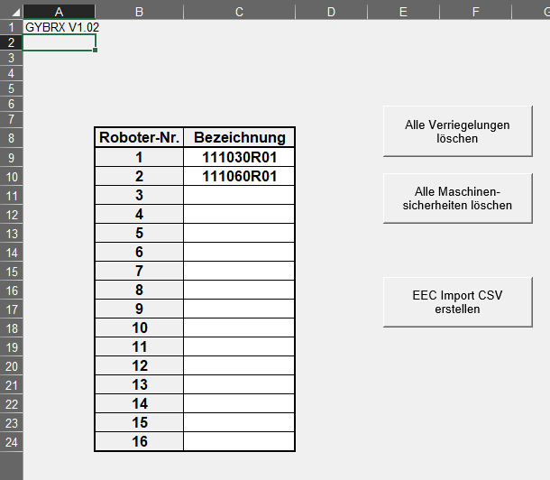
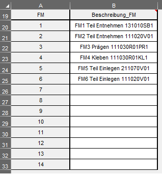
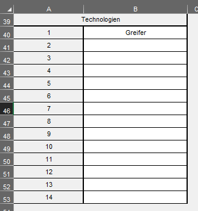
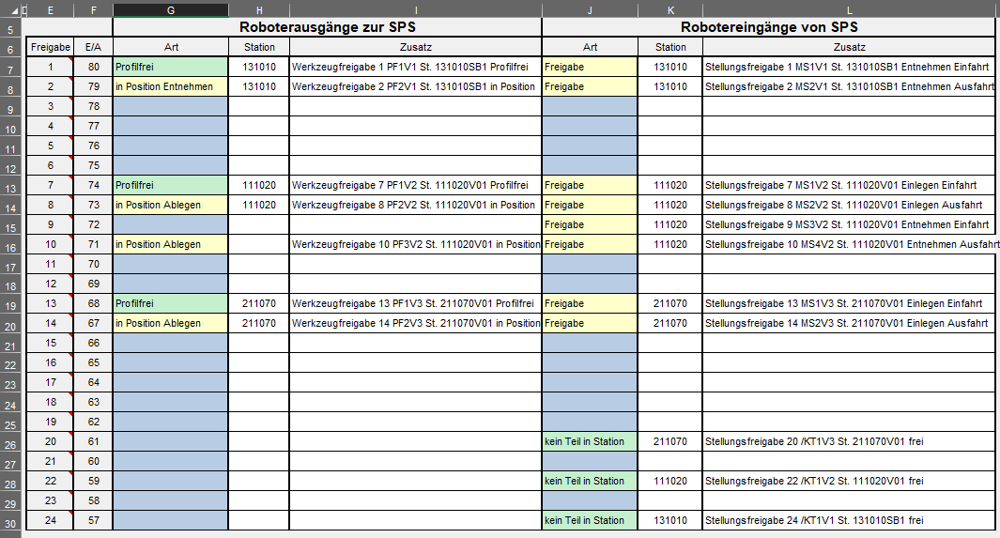
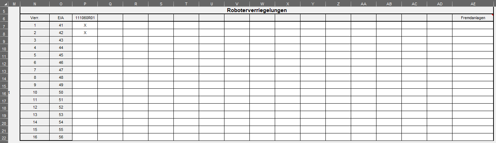

To speed up work with configuration it is possible to import SPS Matrix in 'xlsm' file.
 
# Basic

List of robot is taken from Basic(first) sheet.

:::note
That row, column, table size must be the same like in pattern.
:::

:::important
All robots must exist in structure from Eplan.
:::

---

## FM

Fm is read from top to down or to first empty cell. Matrix reader ignore 'FMx' text on start. (This is added back to comment during generation)    

---

## Tool

Tools is read from top to down.

:::note
Position for tools will in address tags automatically calculated.
:::

---

## Freigabe

From the station column the reader tries to find a structure element for it.
The index is followed by the name, followed by the freigabe comment.

|WerkzeugFreigabe Type   |StellungFreigabe Type |
|:------------------:|:---------------:|
|Profilfrei          |Freigabe         |
|InPositionEntnehmen |StatusMeldung    |
|InPositionAblegen   |KeinTeilInStation|
|InPosition          |                 |
|InPositionPOT       |                 |

:::note
Check if the detected stations for "Freigabe" are read correctly after import.
:::

---

## Interlocks "Verriegelung"

Interlock reads left to right and looks for the first non-empty cell. 
When there is a blockage, the name of the robot from the column at the top will be read and build logic from it.

---