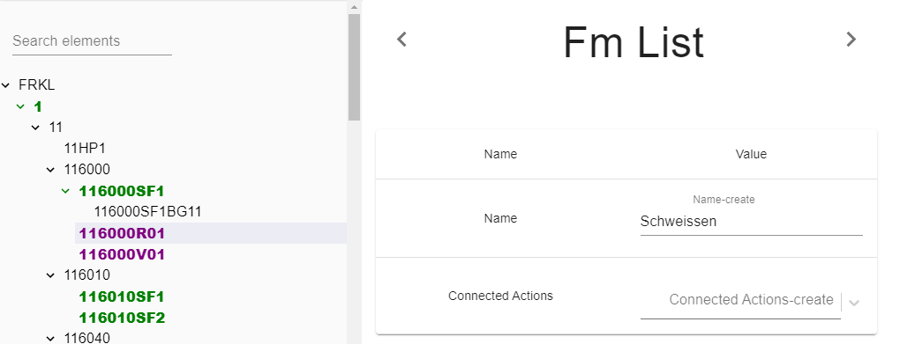

## Description

This parameter is used to add the robot's FM

---

## Definition

| Name              |      Value
| -------------     | :-----------:
| Name              | Name of FM (index will be generated automatically)                
| Connected Actions | Binded process actions (Now is not use, Feature is prepared in progress).  