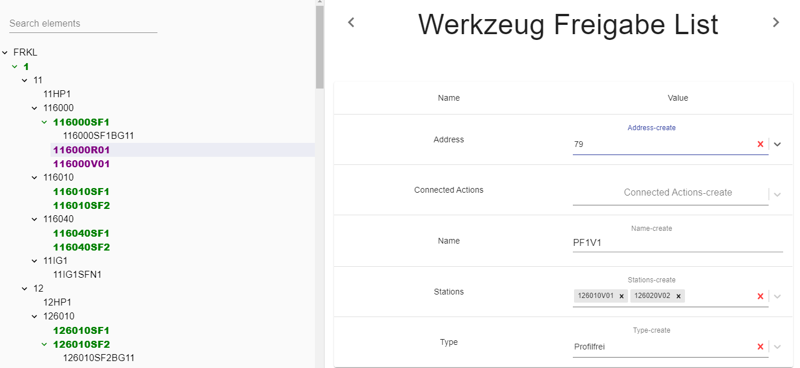

## Description

This parameter is used to define robot's 'Werkzeug Freigabe'.

---

## Definition

| Name              |      Value
| -------------     | :-----------:
| Name              | Name of Freigabe 
| Address           | Unique Friegabe position (57-80) 
| Type              | Type of Freigabe according the standard.
| Stations          | Value is used when selected 'Type' is 'Profilfrei'. Specifies for which station it is used.
| Connected Actions | Binded process actions (Now is not use, Feature is prepared in progress).  

In [Robot Tags](../../generation/tags/Robots) exist address scope for 'Werkzeug Freigabe'.