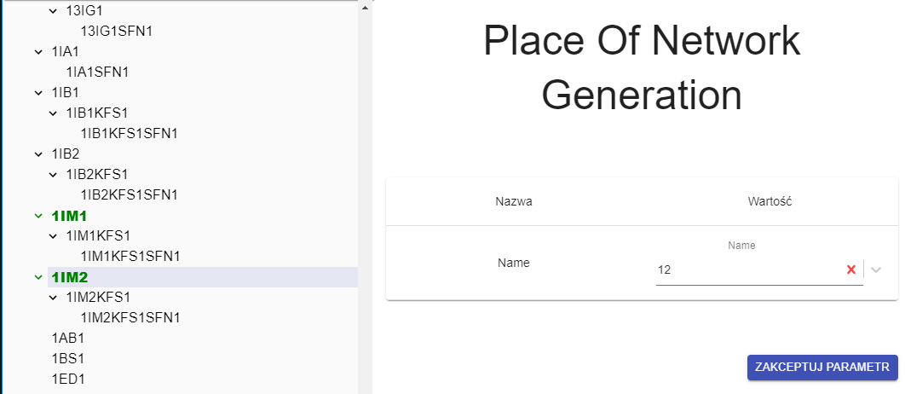

## Description

Parameter is used to select for which zone belongs mobile panel.

---

## Definition

| Name              |      Value|
| -------------     | -------------------|
| Name              | Name of Zone       | 

:::note
If parameter is empty mobile panel will not be generated.
:::