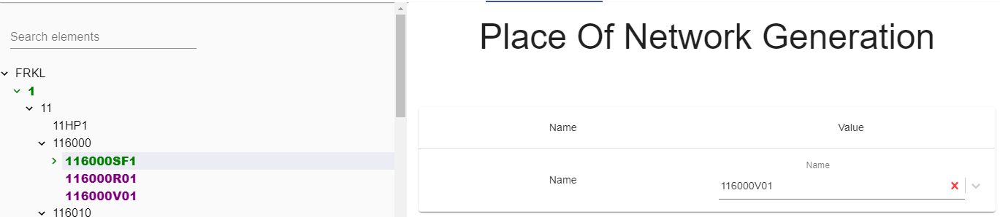

## Description

Parameter is used to select where RoolGate should be generate.

---

## Definition

| Name              |      Value
| -------------     | :-----------:
| Name              | Name of Station 

:::note
If parameter is empty Roll Gate will not be generated.
:::