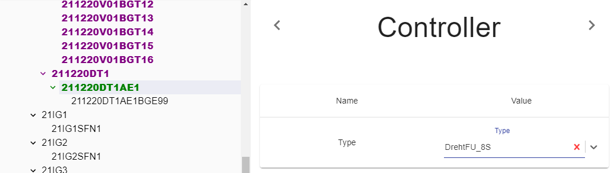

## Description

Parameter is used to define controlled type.

---

## Definition

| Name              |      Value
| -------------     | :-----------:
| Type              | Controller type (Adding more types soon)

