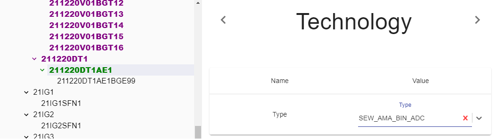

## Description

Parameter is used to define Technology type.

:::note
If is not set. Logic won't be generated.
:::

---

## Definition

| Name              |      Value
| -------------     | :-----------:
| Type              | Technology type (Adding more types soon)

In [Inverter Tags](../../../generation/tags/Inverters) symbols for the selected technology are generated.