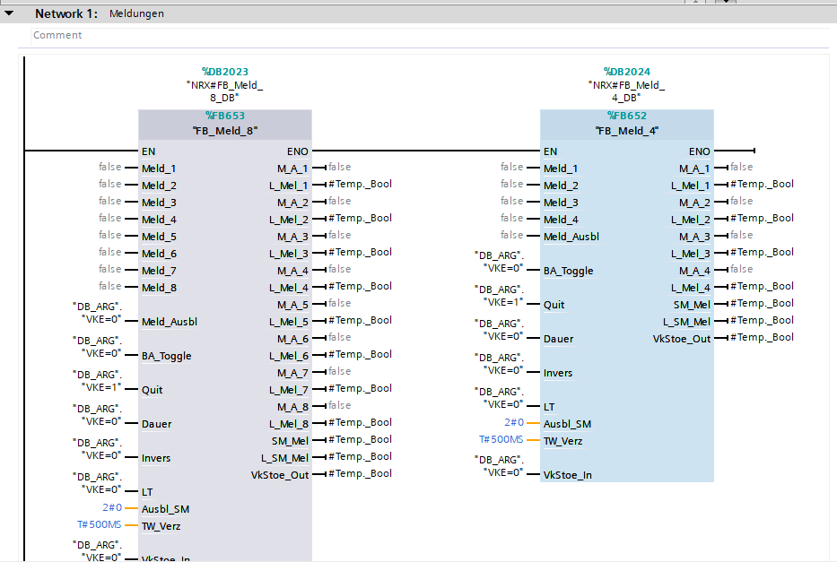
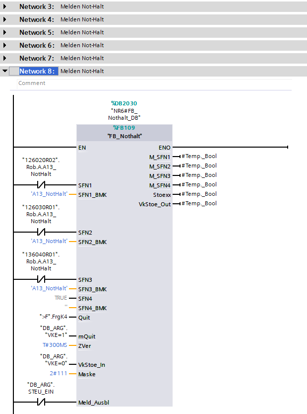
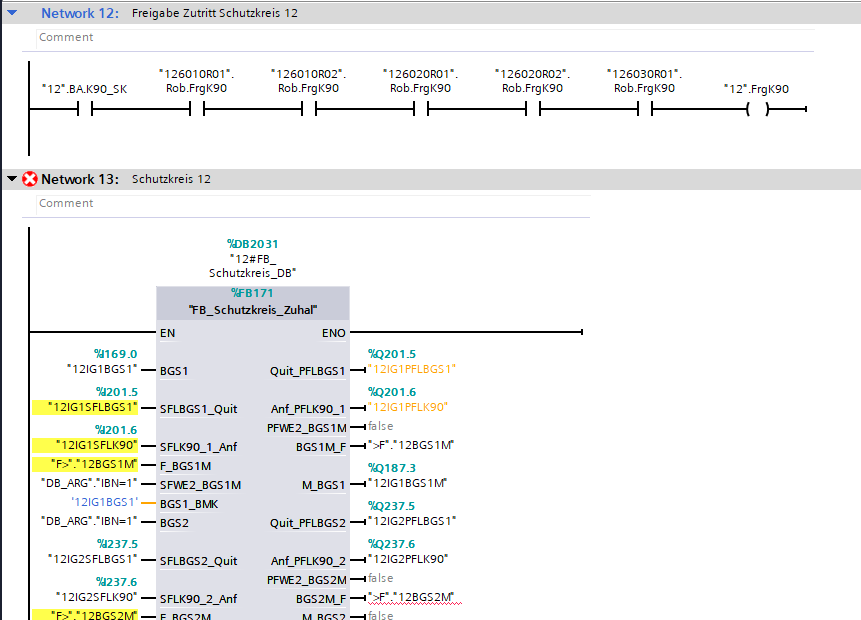
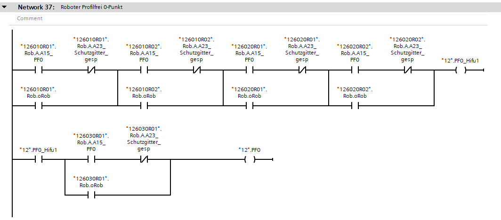
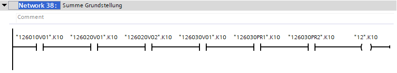
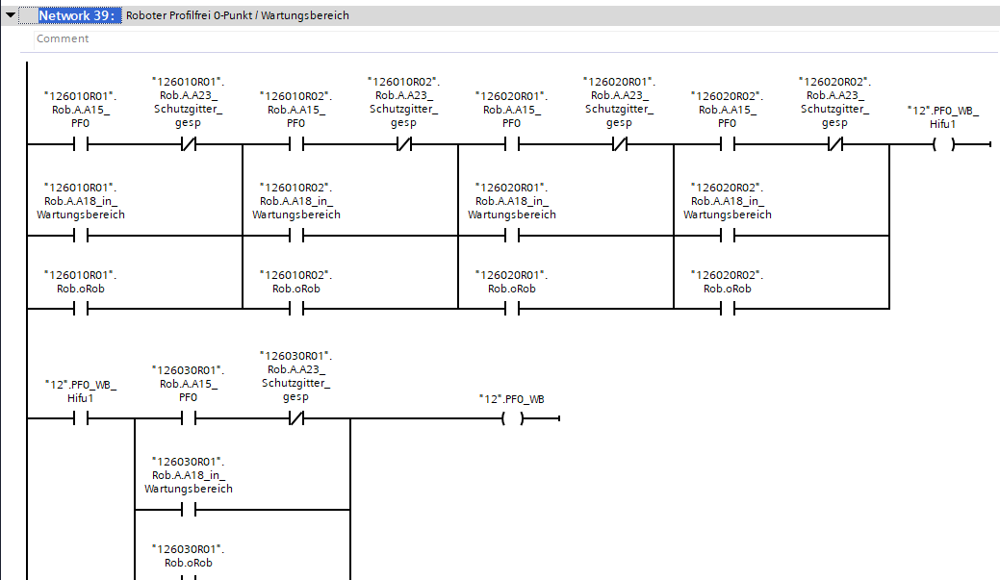
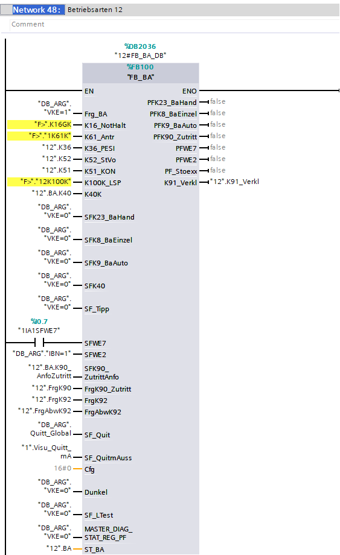
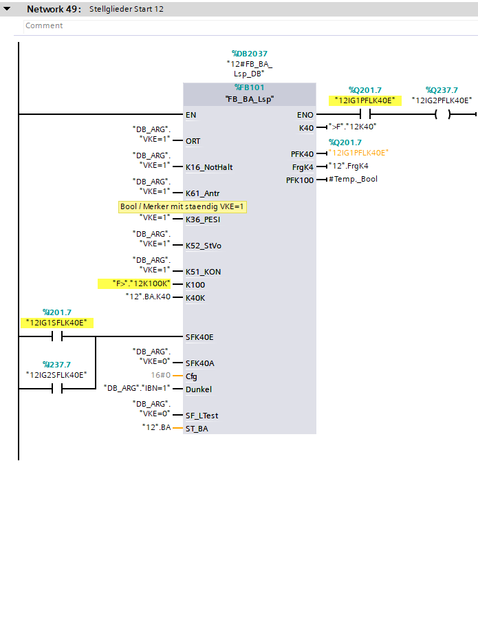
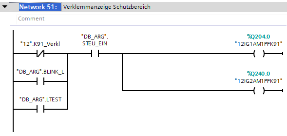
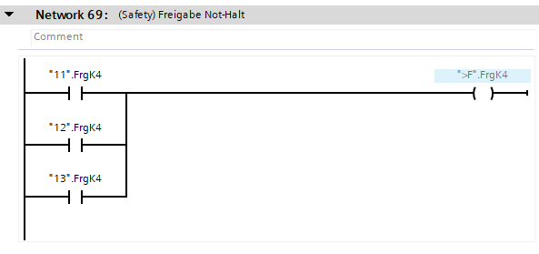

This description includes only the most important elements from the block. The rest is prepared for manual filling.

## Meldung

On this moment exist only empty call (Feature in progress). 

---

### NotHalt

Each finded "Not-Halt" will be parted and connected to 'Meldung' blocks. 

---

## Zone

### Door

Each detected doors will be connected. Actual supported blocks (FB_Schutzkreis, FB_Schutzkreis_Zuhal) 

:::note
If in zone exist 'BGS1M' symbol 'FB_Schutzkreis_Zuhal' will be generated.
:::

---

### PF0

Each robots will be connected to zone 'Profilfrei'.

---

### K10

Each K10 stations will be connected to 'K10' zone.

---

### PF0WB

Each robots will be connected to zone 'Profilfrei/Wartungsbereich'.

---

### BA

Created each per zone. On this moment 'UBA ZONE' is not supported.

---

### LSP

Dected starts button and lamp from zone will be detected to corresponding connectors.

---

### PFK91

Each 'PFK91' lamp detected in zone will be ther connected.  

---

## FrgNotHalt

Summary network for Global 'FrgNotHalt'.

---