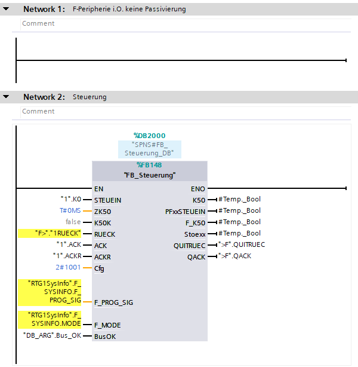
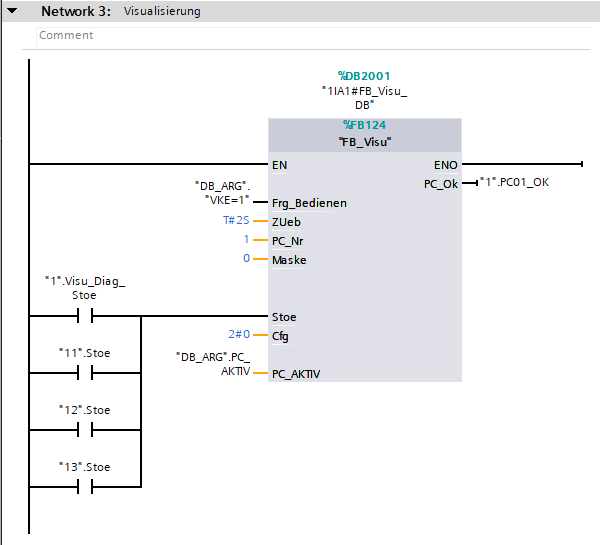
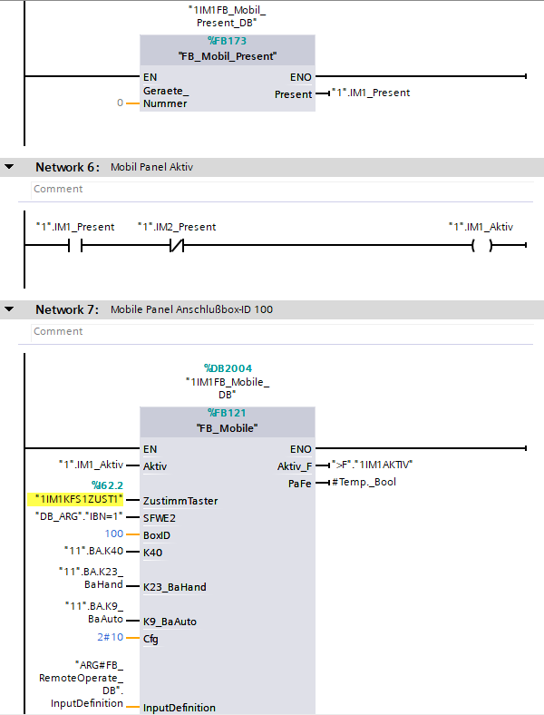
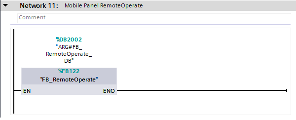
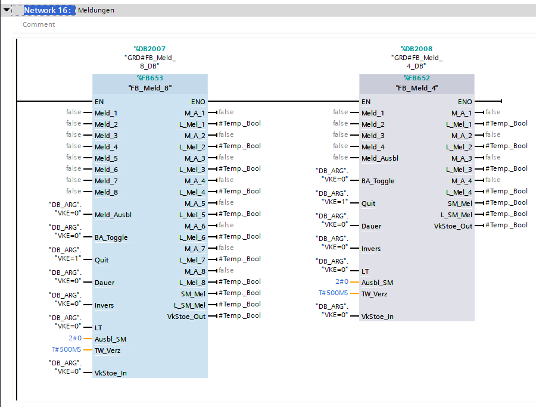

This block may differ depending on the 'GrundProject'. 
Therefore, only the most important elements will be described here

## Control "Steuerung"

On start exist prepared network for 'Passivierung'. Which must be completed by hand.

---

## VISU

'STOE' signals from each zone are connected to the Appropriate input in the 'FB Visu'

---

### Mobile Panel

For each mobile panel prepared is set of networks. For manual refilling.

If mobile panels exist Network 'FB_RemoteOperate' will be created.

---

## Message "Meldung"

On this moment exist only empty call (Feature in progress). 

