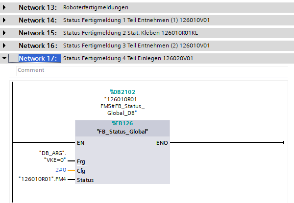
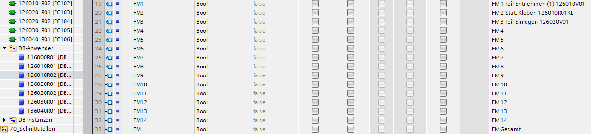
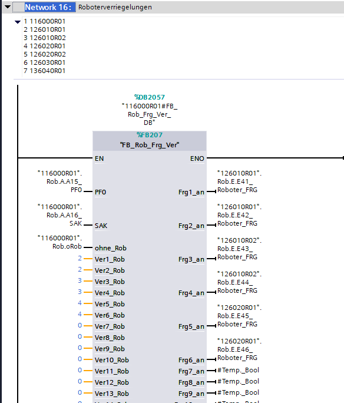
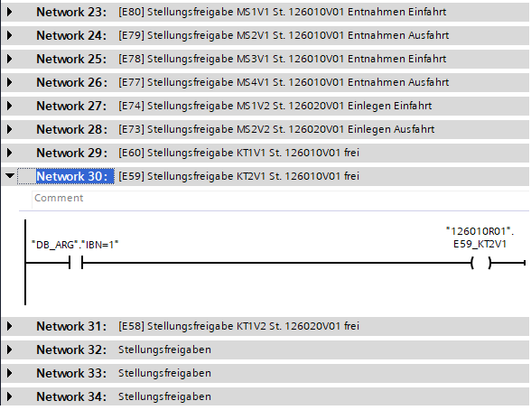
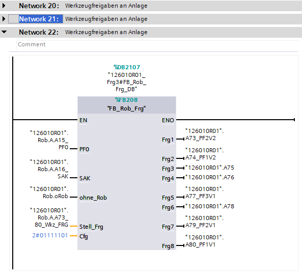
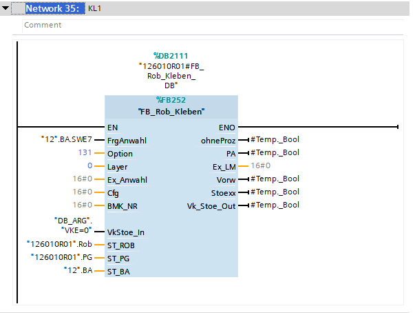

Generator prepared all 'FC' structure, but there will be described only configurable elements.

## Fertigmeldung

Standard "FB_Rob_FM" call is always generated, but after filling [Robot Fm Parameter](../../../configuration/robots/Fertigmeldung)
Status logic 

and comment to Robot db is also added.

---

## Interlock

After filling in the [Interlock Parameter](../../../configuration/robots/Interlock) field. A block call will be generated with the position assigned to the robots.

In network comment is generated list of robot with index.

:::note
Generator also work with external interlocks between plcs.
:::

---

## StellungFreigabe

For each configured [element](../../../configuration/robots/StellungFreigabe). 
A network for manual filling will be prepared.

---

## WerkzeugFreigabe

The block is generated always, but when [WerkzeugFreigabe Parameter](../../../configuration/robots/WerkzeugFreigabe).
will be defined. Cfg and frg connection will be generated.

---

## Tool

For each configured [Tools](../../../configuration/robots/Tools) will be created block of service.

---