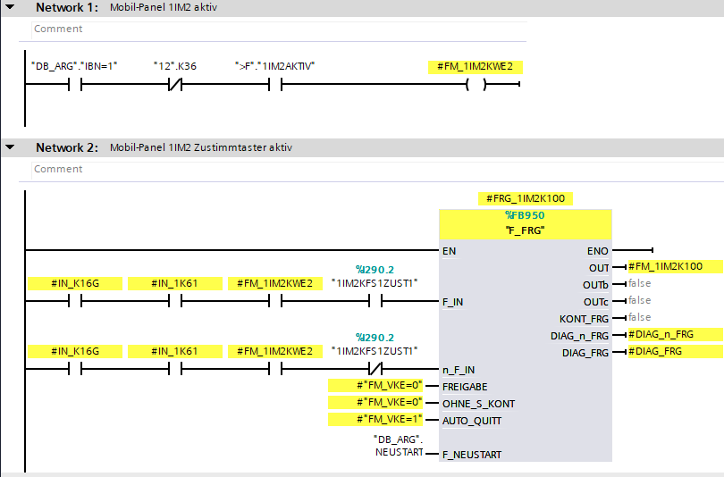
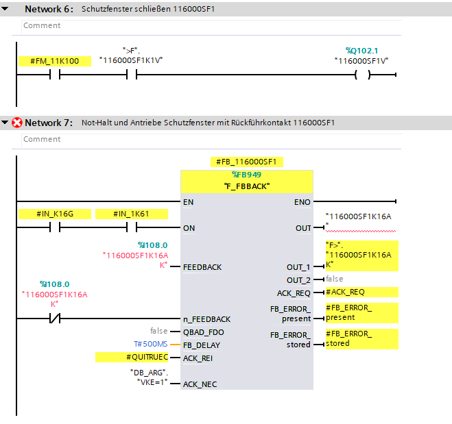
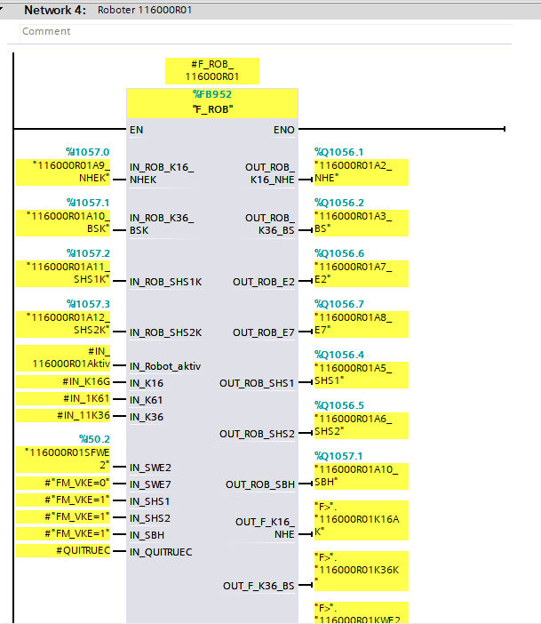
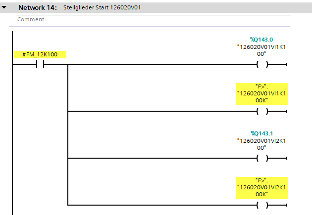
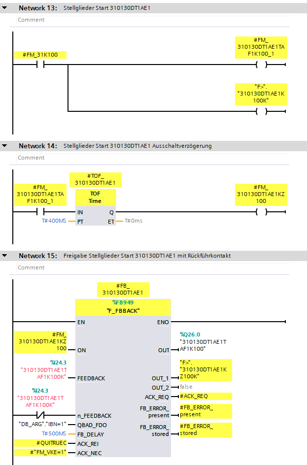

In this FB will be defined behavior of safety zone.

## Mobile Panel

On start will be prepared logic for zusti.

:::note
To change place of generation see [Configuration](../../../configuration/safety/MobilePanel).
:::

---

## Schutzfenster

For each RollGate in zone will be created basic logic for closing.

---

## Robot

For each robot in zone will be created basic robot safety block.

---

## Station

If the station contains the element "K100", the logic for handling will be generated.

---

### Valve Island

---

### Inverter

---