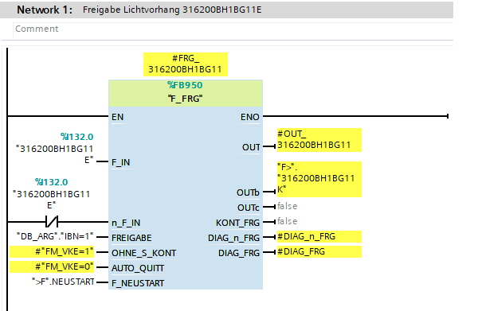

In this FB is generated blocks for servicing safety elements of zone.

## PLS, LVU

First, 'F_FRG' is generated for all scanners and curtains.

---

## Schutzfenster

If zone contain 'Schutzfenster' for each is generated 'geschlosssen' logic.

---

## BGS

In SK blocks on end is generated 'Freigabe Schutzkreis' logic with all doors for zone.

### Zuhal

If doors is 'Zuhal' is also prepared logic for self-completion.

