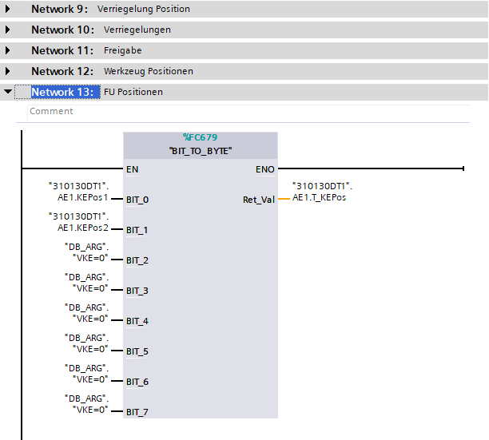
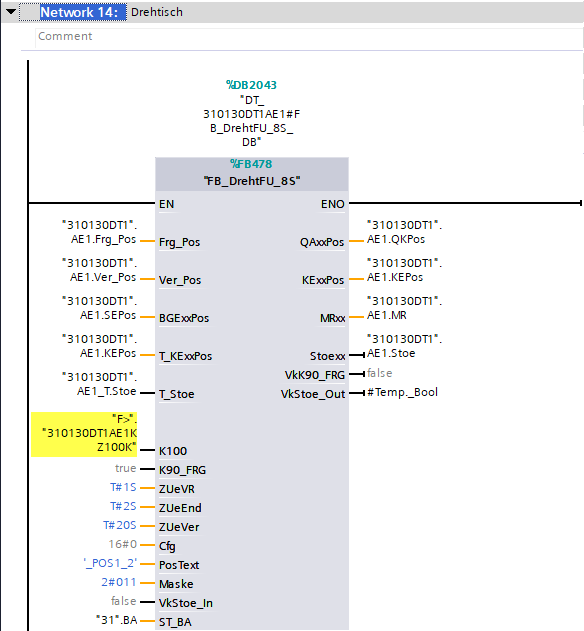

Logic for Inverter is creating by combining three parameters. 
- [Controller](../../../configuration/stations/inverters/Controller)
- [Technology](../../../configuration/stations/inverters/Technology)
- [Position](../../../configuration/stations/inverters/Position)

## Controller

On start created is logic for controller based on information from position.

Dependly Controller Type this block can be different.

---

## Technology

Same like in controller section there also exist information about position.

Technology type call.

---