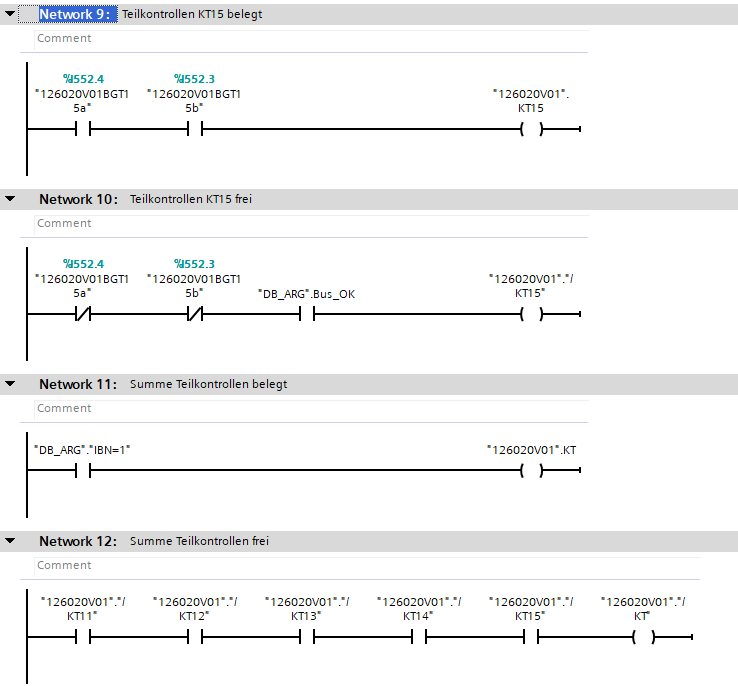
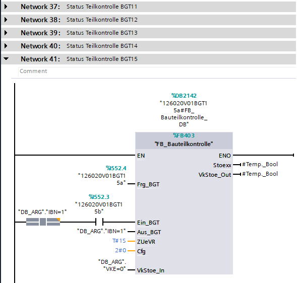

Sensors are grouped by number, and summed to global Market. 

KT is empty, for hand fill.

If [Part Parameters](../../../configuration/stations/sensors/Part) is defined. For each part will be defined marker with selected sensors. 

---

### Status

For each sensors will be created status block. For hand fill.

