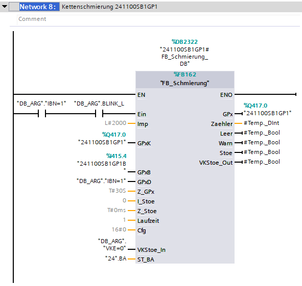
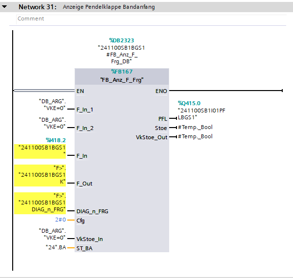
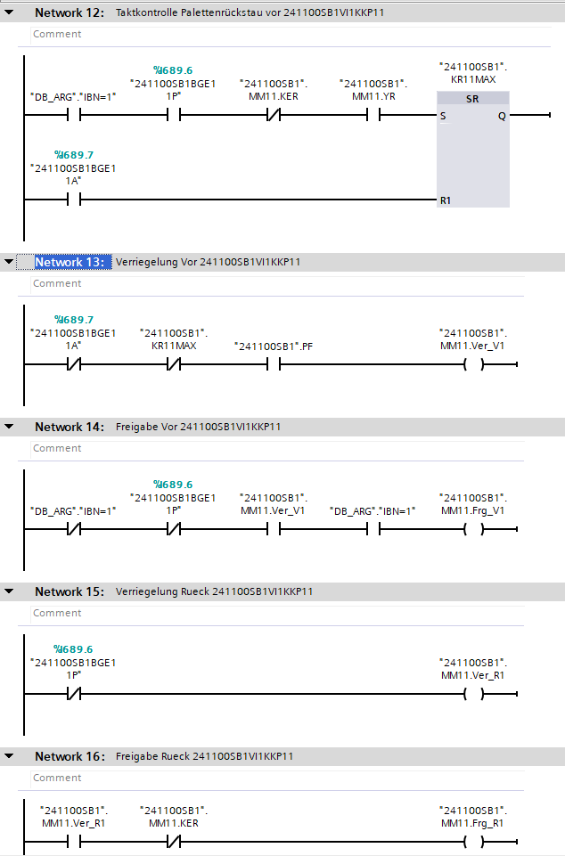

## Lubricator (Schmierung)

Each lubricator will be created standard control logic.

---

## Flap (Pendelklappe)

If flap tags end with a/b, symbols will be connected to F_IN_1/2 else is used F_IN.

---

## Palette

For each valves will be created standard logic for pallet service.

---