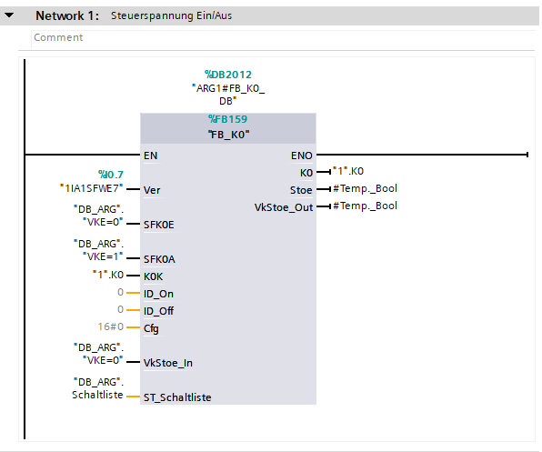
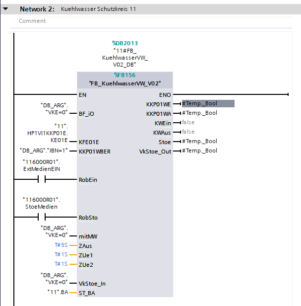
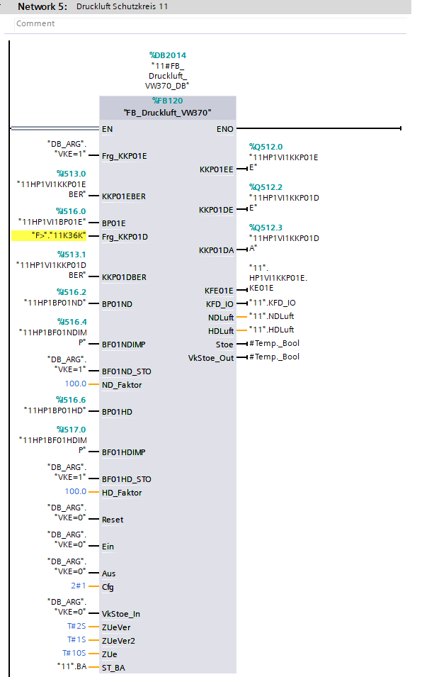
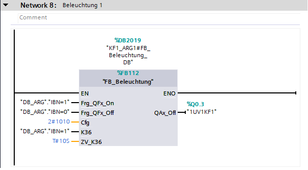
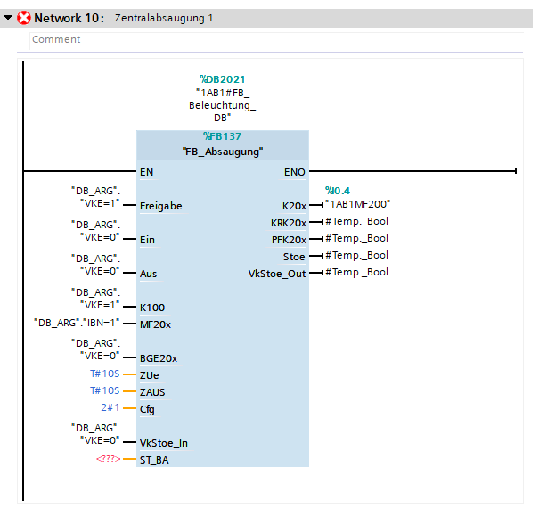
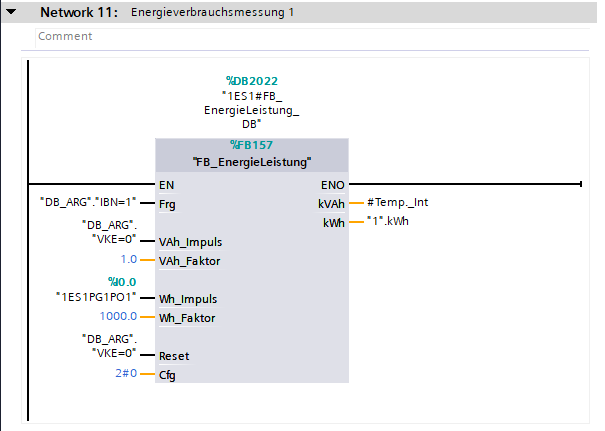

## K0

On start is prepared 'Steuerspannung' call.

---

## Zone 

### Wasser

If Zone contain robot, 'FB_KuehlwasserVW_V02' will be generated.

---

### Luft

By default, 'FB_Druckluft_VW370' is created for each zone.

---

## Belechtung

Block will be generated for each lamp.

---

## Absaugung

For each tag 'MF200' will be called 'FB_Absaugung'. 

---

## Energy

For ES, KV and SV will be generated Energy block. 

---