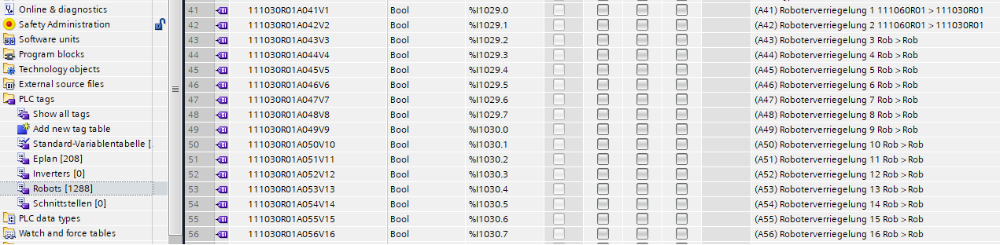
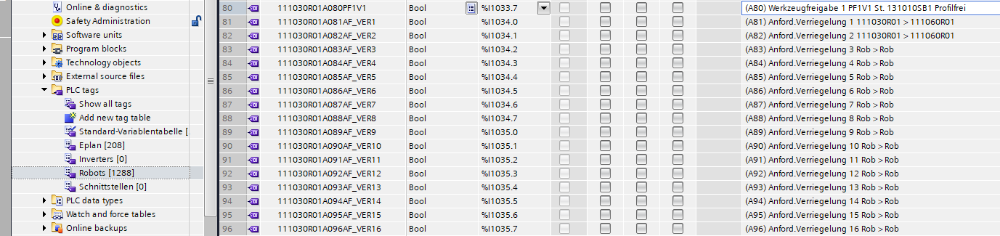
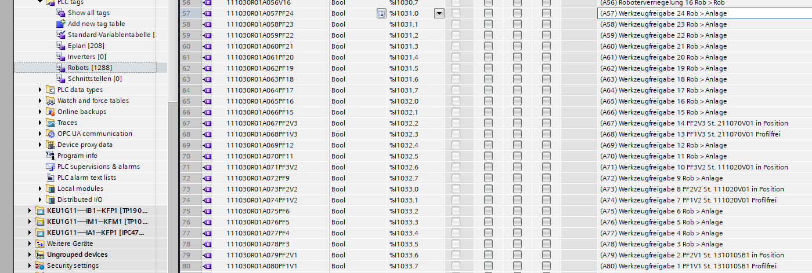
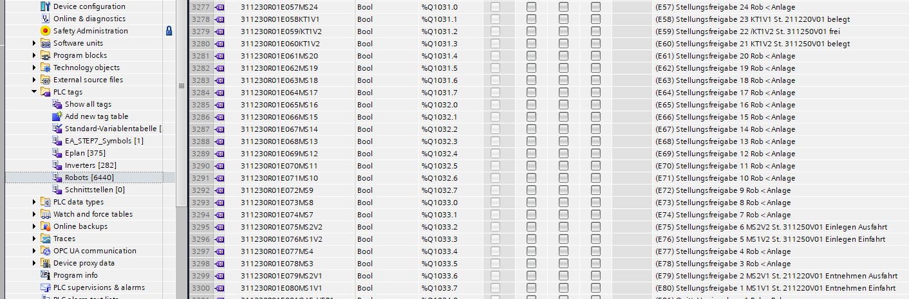
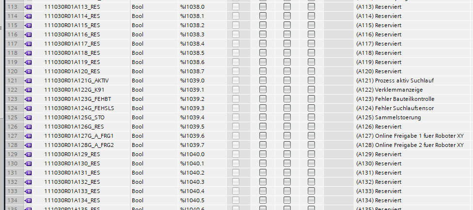

Symbols will be generated for all robots in the order by name, taking into account parameter configuration.

## Interlock

If [Interlock Parameter](../../configuration/robots/Interlock) is configured.
In symbols comment will be set information about collision robot.

---

## Werkzeugfreigabe

Tags between 57-80 will be prepared according 'Freigabe' parameters.

[Werkzeugfreigabe](../../configuration/robots/Werkzeugfreigabe)

[Stellungfreigabe](../../configuration/robots/Stellungfreigabe)

---
## Tool

Symbols for [Tool](../../configuration/robots/Tools) will be created between 113-224.

|Address| Elements| 
|:------:|:-:|
|113_120 | Dock_Fraes (will be added soon)|
|121_128 | Greifer|
|129_224 | options[1-12]|

---