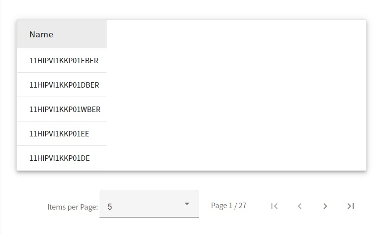
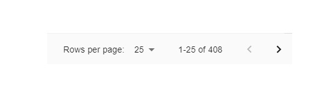

This file will be shown whenever the user filled up the home form.

## The table has basics functionalities.

### Pagination

All records have been <strong>split</strong> into discrete pages.  
The user can change the number of visible records.  
Allowed records per page are <strong>25</strong>, <strong>50</strong>, and <strong>100</strong>.  
The user can change the page to see the next records.  
Close to the "next page" arrow user can see the <strong>quantity</strong> of all records.
