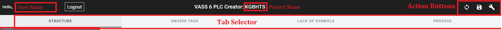

After opening/creating project, you will see main editor view. 
Which was divided in parts using red rectangles.

## Tabs

Tab Selector information about content of selected elements is

<ul>
    <li>[Structure](structure)</li>
    <li>[Unused Symbols](unusedSymbols)</li>
    <li>[Lack Of Symbols](lackOfSymbols)</li>
    <li>[Process](process)</li>
</ul>

## Action Buttons

Reading from left
<ul>
    <li>Sync with cloud - save your changes to database. Which allow you to continue the work after next login.</li>
    <li>Export to json - allow you to save your configuration in your computer.</li>
    <li>Build and Download - after select your configuration will be saved and builded as result you get builded project which must be downloaded by the following [program](https://plctianetlibrary.bmgk.tech/docs/client/Importer).</li>
</ul>

    
    
    
