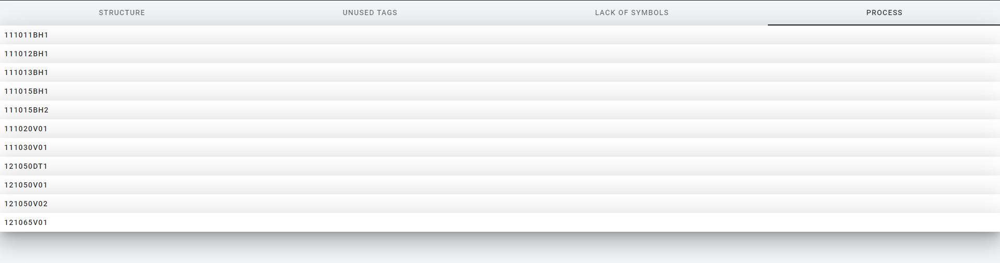
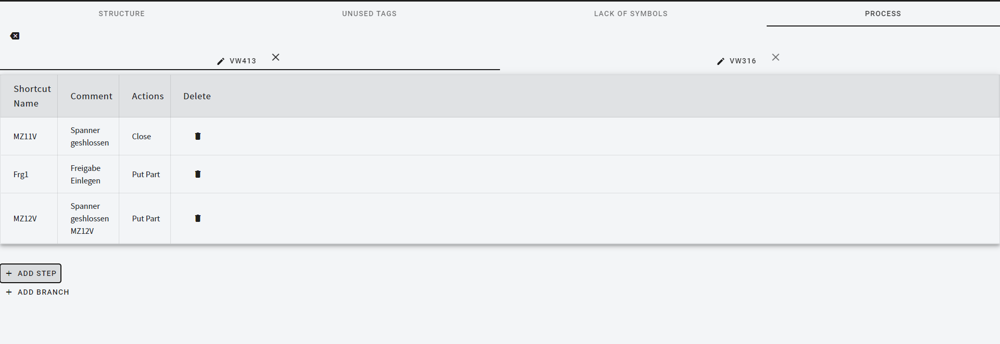
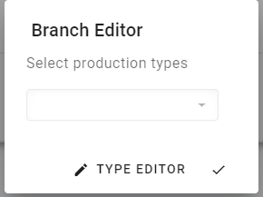
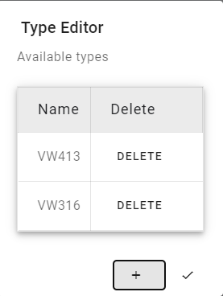
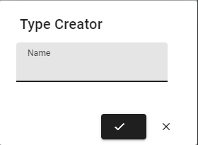
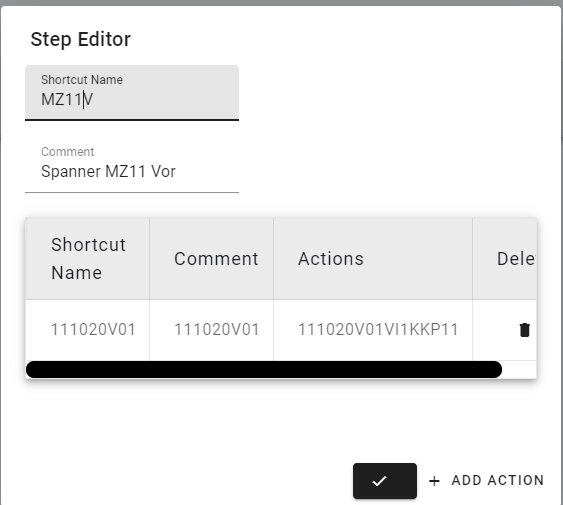
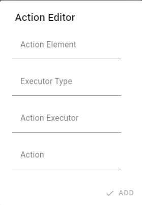

View for prepare sequence. 

## Station Selector

At the start, a list of all items with graph is shown. 
Double-click on it to display the process editor.

## Process editor

Your branches are at the top of the process editor. 
To create a new one, click the "Create branch" button.

### Branch Editor

The branch editor supports working with types. You can choose which types the selected branch works for.

If you want to create a new type, you can click the type editor button.

### Type editor

You can delete or edit existing types in the project. 
To create a new one, click add.

#### Type Creator

The name field is <string> required </string> and must be <strong> unique </strong>.

### Step Editor

To add a new step, just click the "add step" button and the step editor will appear.

The Shortcut Name field is <string> required </string> and must be <strong> unique </strong> for each step in each branches.

The Comment field is <string> required </string> and must be <strong> unique </strong> for each step in each branches.

Actions must be <strong> unique </strong> to create new you need to click "Add Action"

### Action Creator

Action Element is the structure element which is responsible for action.

Executor type is kind of executor element. this could be ventil or tool on robot.

:::note
Robot executors will show after define robot tool in configuration section.
:::

Action Executor is specified element which will perform the action.

Action is the information what this tool/element will do.

