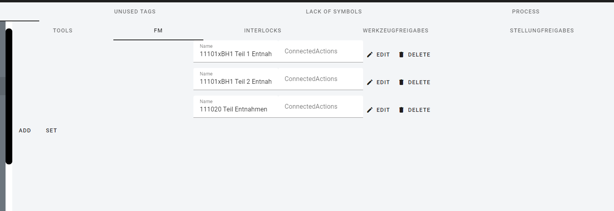

After opening/creating project, you will see main editor view. 
Which was divided in parts using red rectangles.

## Tabs

## Structure Tree

The sidebar contains a mapped line structure based on eplan tags.

Some elements of the structure tree can be configured, to do this just click on it, and in the parameterization window, you will see possible options.
List of all configurable elments could be found [here](../../configuration/plc/Communication).

## Parameter Window

The content of this window depends on the selected tree element.

Most of the parameters have the structure of a list, the records of which can be added, edited or deleted by pressing the appropriate button.
To confirm the action, use the SET button.

## Action Buttons

Reading from left:
    - Sync with cloud - save your changes to database. Which allow you to continue the work after next login.
    - Export to json - allow you to save your configuration in your computer.
    - Build and Download - after select your configuration will be saved and builded as result you get builded project which must be downloaded by the following [program](https://plctianetlibrary.bmgk.tech/docs/client/Importer).

