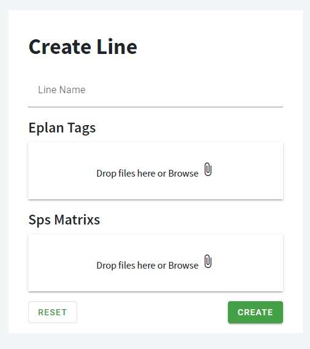

## Form

### Line Name

Write here line name without plc number. The field is <strong>required</strong>.

### Eplan Tags

Button for uploading Zuli files from eplan. You can upload more than one. For each plc in line. The file format is <strong>".sdf"</strong> At least one file is <strong>required</strong>.

### SPS Matrix File

Button for uploading SPS Matrix files. You can upload more than one. For each plc in line. The file is an <strong>excel</strong> file. The field is <strong>optional</strong>.
You can download [Sample Sps Matrix](https://mega.nz/file/o8VSWZhD#Y5jopDeYwCCWvsHUaGFbu7-jynlEDuJlqktc0FIkAKQ) template file. 

### Create

Button for creating the line. After successfully submit, the application will redirect to [Structure](../editor/mainView).
