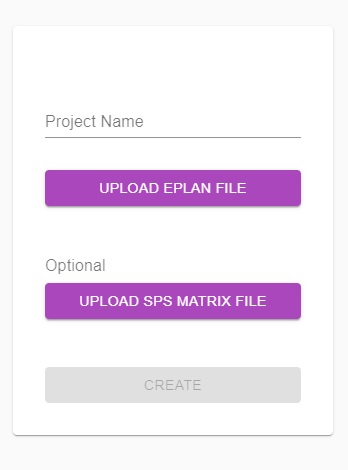

## Form

### Project Name

This is the project name. A newly generated project will have the same name. The field is <strong>required</strong>.

### Upload Eplan File

Button for uploading Eplan files. You can upload more than one Eplan file. The file format is <strong>".sdf"</strong> At least one file is <strong>required</strong>.

### Upload SPS Matrix File

Button for uploading SPS Matrix files. You can upload more than one SPS Matrix file. The file is an <strong>excel</strong> file. The field is <strong>optional</strong>.

### Create

Button for submitting the form. After successfully submit, the application will redirect.
