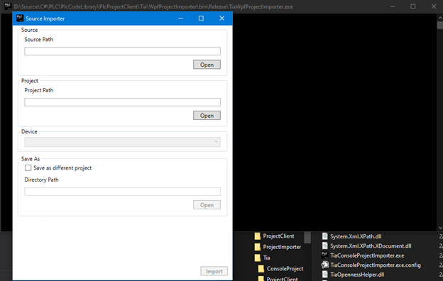
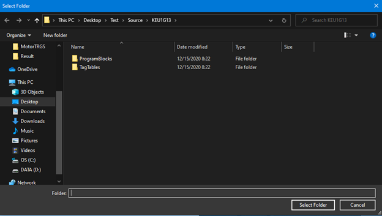
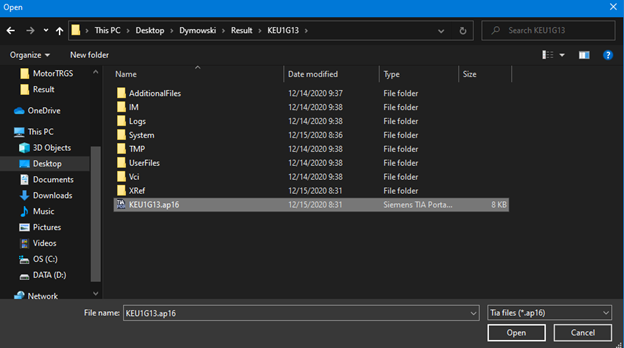
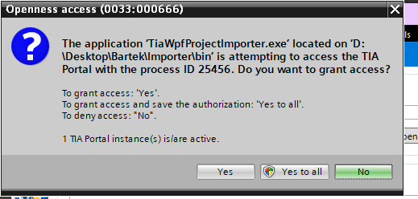
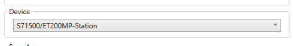
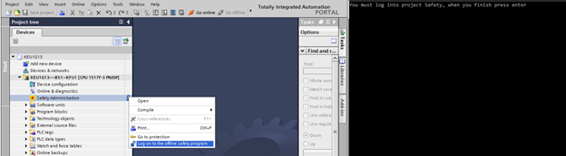

You can automate programming workflow using dedicated tool.

1. After run Tia.WPF.Importer you will see main application view.

2. Select diretory with exported xml files.

:::note
Content must be extracted from zip file.
:::

3. Select project to which xml files will be imported.

4. Grant permission for application.

5. Select Plc device.

6. Log to program safety and wait.

