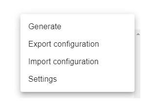

## Menu

### Generate

This option generates a project based on the current structure of parameters. After selecting this option, the application will be parsing records, and the backdrop will be visible. After completion of this action, the user has to select the folder for the newly created project.

### Export configuration

This option gives the user possibility to save the current structure of parameters. It can be used as a saving mechanism.

### Import configuration

This option gives the user possibility to load the structure of parameters that the user previously exported. It can be used as a loading mechanism.

### Settings

This option gives the user possibility to customize the settings of the application.
