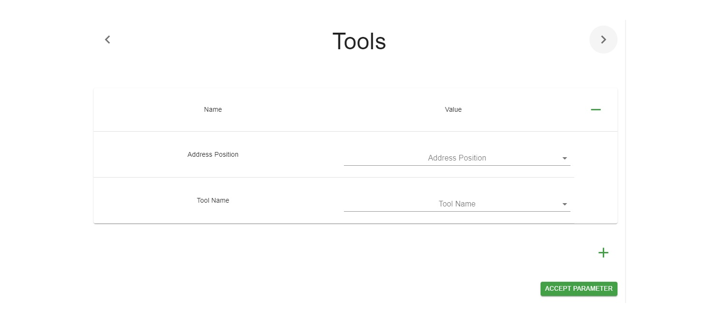

This file will be shown whenever the user filled up the home form and selects Structure tab.

## Panel

After selecting the structure line, on the right side of the page, the parameter panel will be visible.  
This panel contains.

### Header

On the header of the panel is located the name of the parameter.  
If a selected line has more than 1 parameter, additional arrows will be visible for navigation between parameters.  
If a selected line has not had navigation arrows, it means that the structure line has only one parameter.

### Body

This area will contain values of the parameter. Every table is equivalent to one value.  
Inside the table two types of inputs are available.  
Free text, and a dropdown with predefined values.  
The user has the option to change the values of an existing table.  
The user has the option to delete a whole table via the "-" button.  
The user has the option to create an additional table via the "+" button.  
There is no limit to the number of tables.

### Submit

For submitting values for the specific parameter the user has to click the "Accept Parameter" button.  
The "Accept Parameter" can succeed or fail.  
If succeed, a green notification will appear at the bottom of the application.  
If failed, a red notification with details about the error will appear at the bottom of the application.
