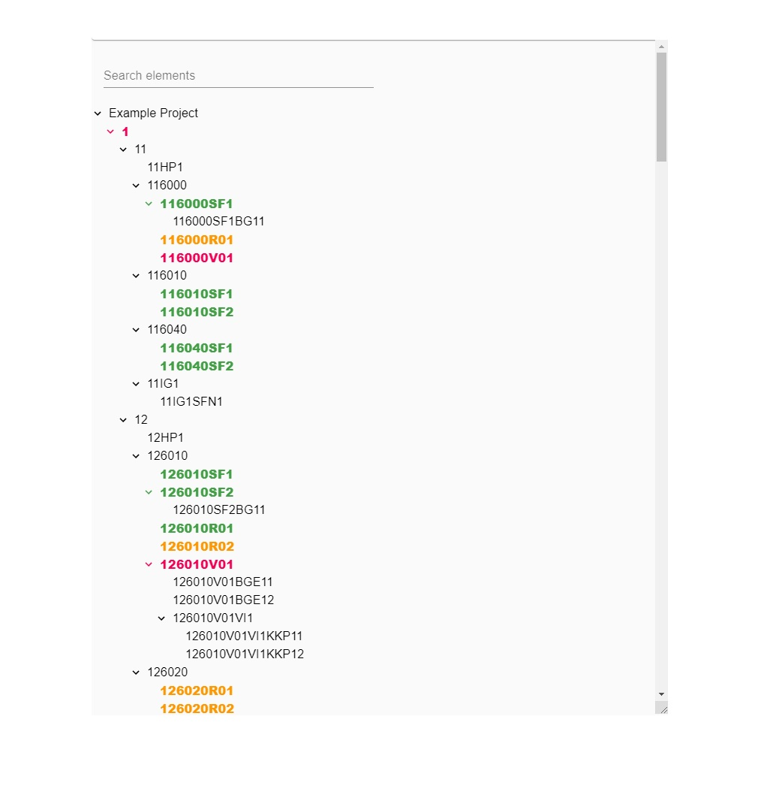

This file will be shown whenever the user filled up the home form and selects <strong>Structure</strong> tab.

  

# Basic information

This view shows line structures as a <strong>tree</strong>.  
Whenever the user select <strong>tree element</strong>, the parameter panel will be shown on the right side of the page.  
Every tree element can have one of <strong>5 colors</strong>. Every color has its own meaning.  
On the very top of the tree section, the user has a possibility to <strong>filter</strong> structure elements.

## Colors

### Black

<strong style={{color: 'black'}}>An element without parameters.</strong>

### Yellow

<strong style={{color: '#ff9800'}}>
  An Element partially configured. Opened.
</strong>

### Green

<strong style={{color: '#43a047'}}>
  An Element with configured all parameters. Opened.
</strong>

### Blue

<strong style={{color: '#43a047'}}>
  An Element is updated right after accepting parameters from another structural
  element. Opened.
</strong>

### Purple

<strong style={{color: '#43a047'}}>
  An Element with parameters. Not opened.
</strong>

## Filter

If the search bar is <strong>empty</strong>, all records will be <strong>visible</strong>.  
The user has also the <strong>possibility</strong> to fold and unfolds elements.  
Any new values in the search bar will <strong>reset</strong> all foldings and <strong>fold</strong> all records that will <strong>not match</strong> the criteria.  
After entering a value the number of matching results will be shown next to the search bar.

## Dynamic size

The user can <strong>resize</strong> the structure tree component by selecting the <strong>right bottom corner</strong> of the tree container and manipulating width via mouse.
