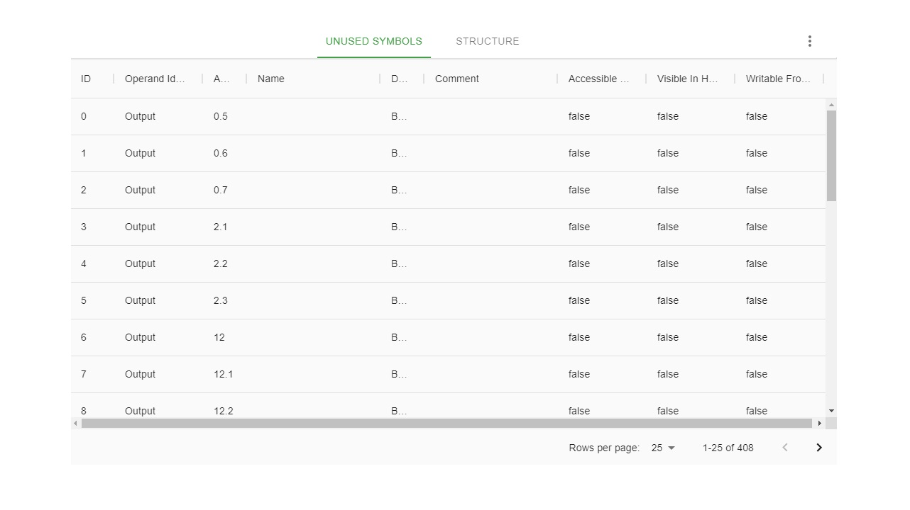

This file will be shown whenever the user filled up the home form.

## The table has basics functionalities.

### Sorting

Whenever the user clicks one of the headers of the table, sorting functionality will apply.  
The <strong>first</strong> click will sort records <strong> ascendingly</strong> regarding of value inside this column.  
The <strong>second</strong> clickwill sort records <strong>descendingly</strong> regarding of value inside this column.  
The <strong>third</strong> click will <strong>reset</strong> any sorting mechanisms.  
Whenever a user clicks a <strong>different</strong> column than previously, any sorting mechanism will <strong>reset</strong> and new sorting will be applied.

### Pagination

All records have been <strong>split</strong> into discrete pages.  
The user can change the number of visible records.  
Allowed records per page are <strong>25</strong>, <strong>50</strong>, and <strong>100</strong>.  
The user can change the page to see the next records.  
Close to the "next page" arrow user can see the <strong>quantity</strong> of all records.
